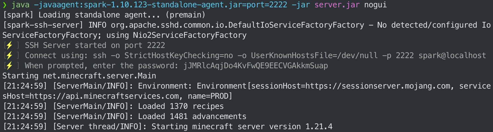
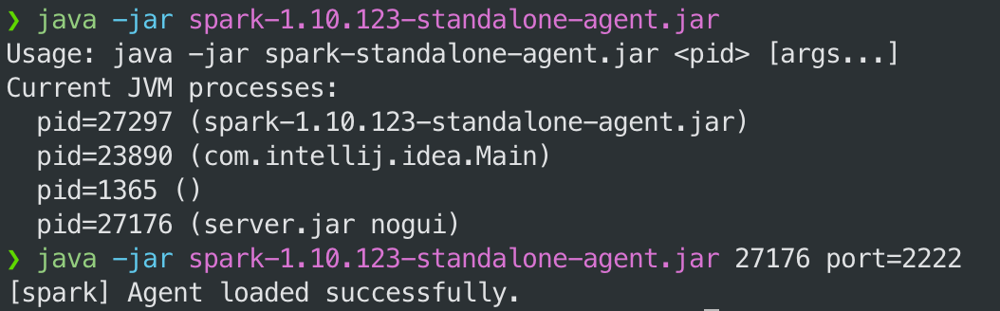
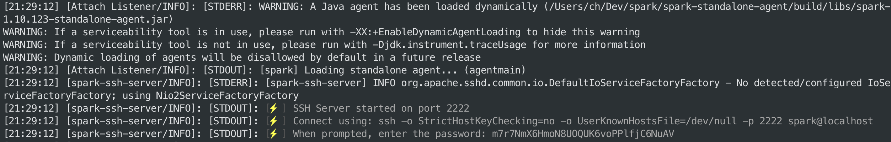
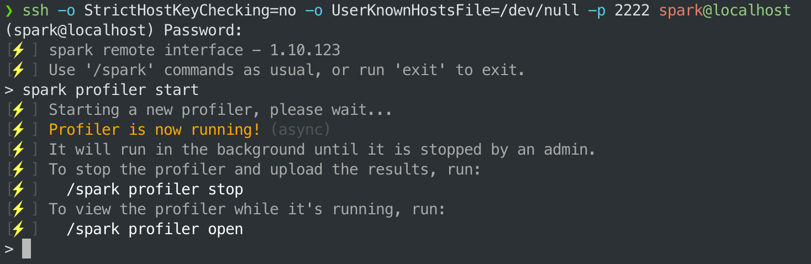

As well as running as a plugin/mod on a Minecraft server, client or proxy, spark can also be used to profile any sort of application that runs on the Java Virtual Machine (JVM). For example, web apps, Discord bots or pretty much any other app written in Java, Kotlin, Scala, etc.

This is achieved by attaching spark to the JVM as a "Java agent".

:::tip

This method also works for profiling an un-modded "vanilla" Minecraft client or server, which itself is ultimately just a Java application! The examples below demonstrate this.

spark has additional integrations for the Vanilla Minecraft server and will apply deobfuscation mappings automatically when profiling a vanilla server.
:::

## Installation (Attach at startup)

Download the spark standalone agent jar from the [downloads page](https://spark.lucko.me/download).

Then, when starting your application, add the following `-javaagent` argument at the start of the command.

For example:
```bash
java -javaagent:spark-x.y.z-standalone-agent.jar -jar application.jar [application args]
```

You can also specify the port the agent should listen on by adding the `port` argument. For example:
```bash
java -javaagent:spark-x.y.z-standalone-agent.jar=port=2222 -jar application.jar [application args]
```



## Installation (Attach to a running process)

To attach the spark standalone agent to a Java application that is already running, you can run the following command:

```bash
# replace <pid> with the process ID of the running Java application
java -jar spark-x.y.z-standalone-agent.jar <pid>

# or with a specific port
java -jar spark-x.y.z-standalone-agent.jar <pid> port=2222
```

If you run the jar without a PID, it will display a list of all running Java processes and their PIDs.



After the agent has attached, the connection instructions will be printed to the console/logs of the application itself.



## Usage (SSH interface)

Once the agent is attached, you can interact with it using a special SSH interface. When the agent starts, it will print connection instructions to the application console/log output.

Simply copy/paste the ssh command into a new terminal window, and enter the password when prompted.



Once in the SSH interface, you can run the usual set of [spark commands](Command-Usage), as well as the special `exit` command to disconnect from the interface.

## Agent Arguments

When attaching the agent, you can specify the following arguments:

- `port={port}` - the port the agent should listen on. Default is `2222`.
- `start` - if present, the agent will start profiling immediately after attaching
- `open` - if present, a link to the viewer will be printed to the console/logs after attaching

Multiple arguments can be specified by separating them with a comma. For example:
```bash
java -javaagent:spark-x.y.z-standalone-agent.jar=port=2222,start,open -jar application.jar
```
